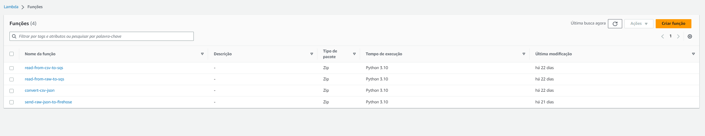
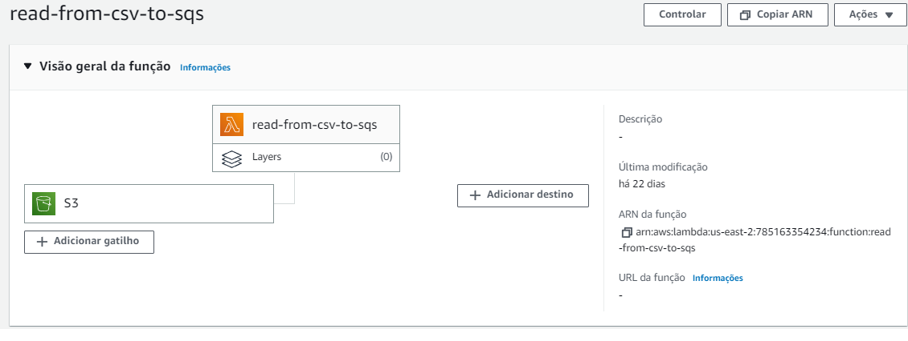
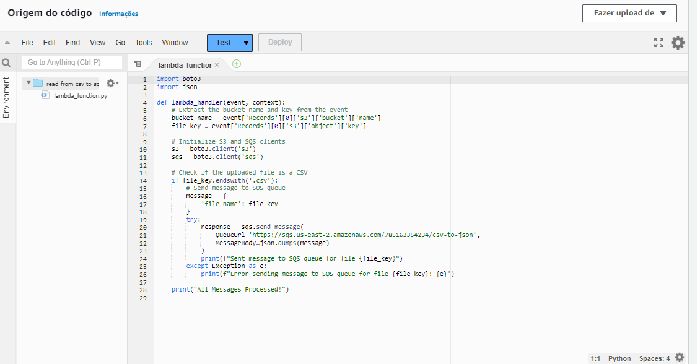

## The purpose of this file is to guide the event driven ingestion

1. The scripts used in the manual ingestion process should be uploaded into lambdas with specific triggers related to the ingestion process.
2. The previous scripts were broken down according to the following
  2.1 converter-csv-to-json was broken into:
    - converter-csv-to-json-1 that will read from CSV bucket to SQS
    - converter-csv-to-json-2 that will effectively convert the CSVs to JSONs

  2.2 sender-json-to-firehose was broken into:
    - sender-json-to-firehose-1 that will read from JSON bucket to SQS
    - sender-json-to-firehose-2 that will send the JSONs to firehose. 

Lambdas inside AWS console:

Example configuration for read-from-csv-to-sqs lambda (using the converter-csv-to-json-1.py code)

The other lambdas should be configured with the additional scripts inside this folder.

OBS:

1. Each JSON row is being broken into smaller chunks and being sent as a separate event to firehose. Firehose is then combining chunks into 100MB files before putting them to the final S3 bucket.
2. Small updates were made to the scripts being used by the lambdas so they could fit the event processing flow.
3. When configuring the lambdas, some adjustments to the default configurations such as increasing timeout and memory might be necessary.
