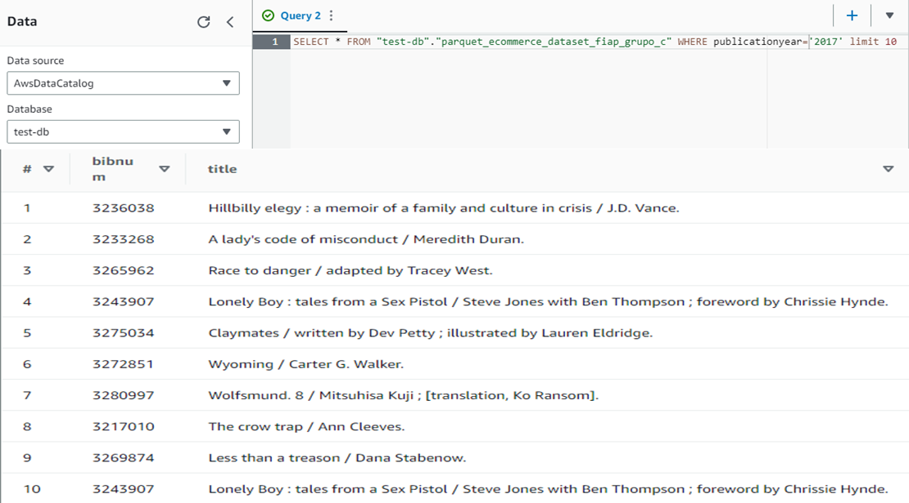

## The purpose of this file is to guide the consumption of data through Athena 

To achieve the desired goal, we will need to configure on the console:

1. A Glue ETL job that gets data from the firehose bucket and transforms it into parquet format (the script can be found inside this folder)
2. A Crawler inside Glue Crawlers that will read the parquet files and create a table inside Athena with the inferred schema
3. Just go to Athena and click on preview table for the AWS Data Catalog database that was created to store the table

Additional necessary side configurations to be applied, respectively:
1. Create IAM role for Glue
2. Create Athena Database for the table that will be generated by the Crawler (can be done while configuring the Crawler)
2. Create Bucket for Athena to store query results and add it to Athena working group

After completing all the configurations, it should be possible to query the parquet files directly from Athena as exemplified below:

