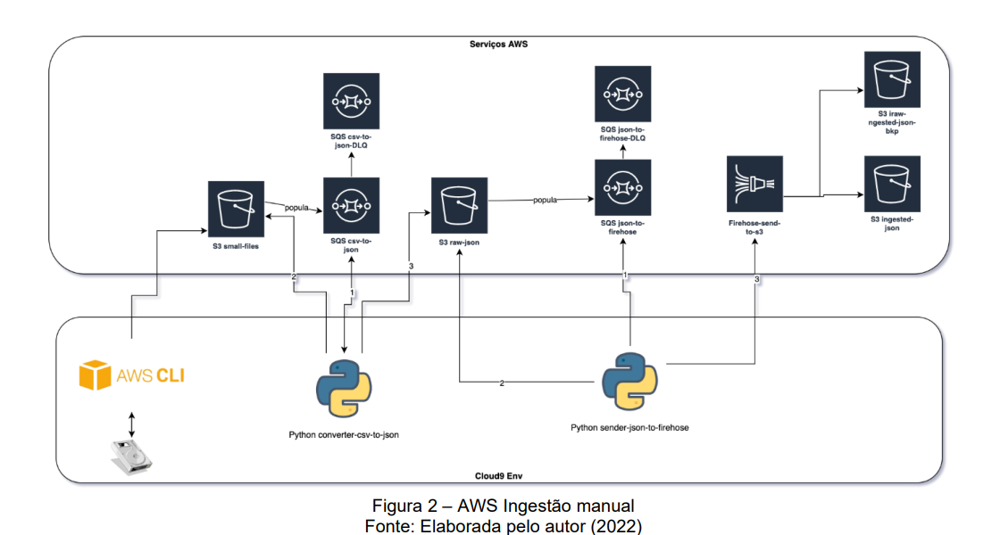
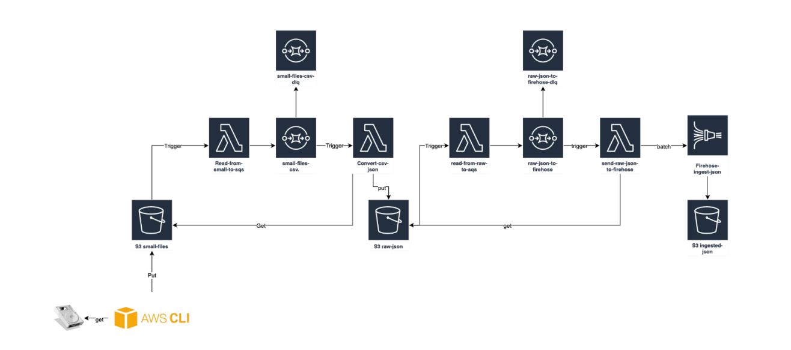
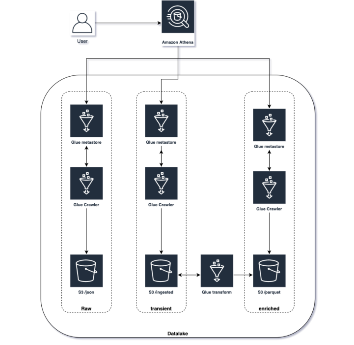

# fiap-data-engineering-sprint3-aws
This repository contains the solution for the FIAP - MBA Data Engineering Sprint 3 AWS Challenge. 

The 8ABDO - Fase 3 - Solution Sprint.pdf contains the original challenge file. This challenge is composed of 3 sub-challanges, as explained below. The code to set-up each sub-challenge solution can be found in individual folders and further explanation is provided in individual read me files.

The dataset choosed for this project can be find here: https://www.kaggle.com/datasets/city-of-seattle/seattle-library-collection-inventory. It should be downloaded and broken into smaller pieces so it can be processed. This can be done using the csv-breaker.py script inside the dataset folder.

## Challenge 1 -  Manual Ingestion

For the manual ingestion an example can be seen in Figure “AWS
Manual Ingest”, where a Cloud9 Env environment has AWS CLI and scripts written
in Python to convert and send files, and AWS Services highlighted
for some Amazon S3 functionality and technologies.

An AWS Cloud9 environment is a place to store your
project and where to run the tools to develop your applications. You
can create and switch between multiple environments, with each environment configured
for a specific development project. By storing the environment in
cloud, your projects no longer need to be linked to a single
computer or server configuration. It allows you to do things
how to easily switch between computers and onboard developers more
quickly to your team. You can thus work with code in various
programming languages ​​and the AWS Cloud Development Kit (CDK), use
online code repositories, collaborate with others in real time,
interact with various database and website technologies, among others
possibilities.

AWS CLI, or Command Line Interface, is a unified tool
for managing AWS services. With command lines it is possible
control multiple services and automate them using scripts. It has several
features including improved installers, new configuration options,
such as AWS Single Sign-On (SSO) and various interactive features. This project uses CLI to work with S3, SQS and Firehose. In this challenge, python code is run manually to support the application functioning.

## Challenge 2 -  Event based Ingestion

This project aims to automate the manual workload from the previous project by replacing the python code that has to be run manually by lambda events according to the following architecture:

## Challenge 3 -  Analysing data

Glue and Athena are added to our project to enable queyring information directly from our data lake S3 buckets from different zones (raw, transient, enriched).

